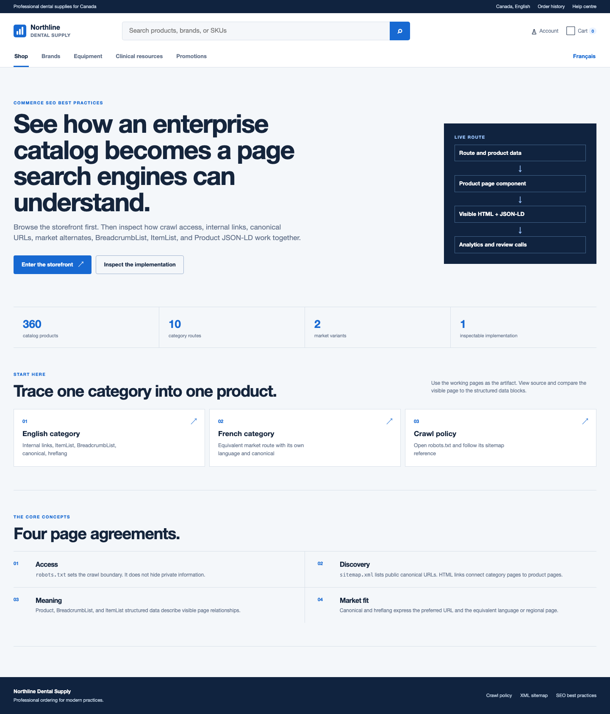
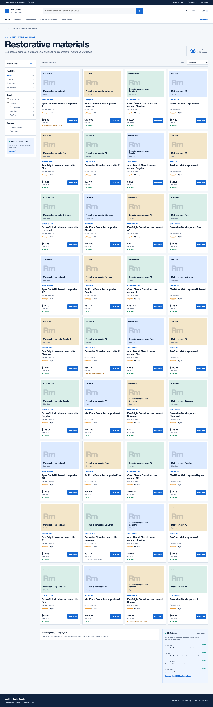
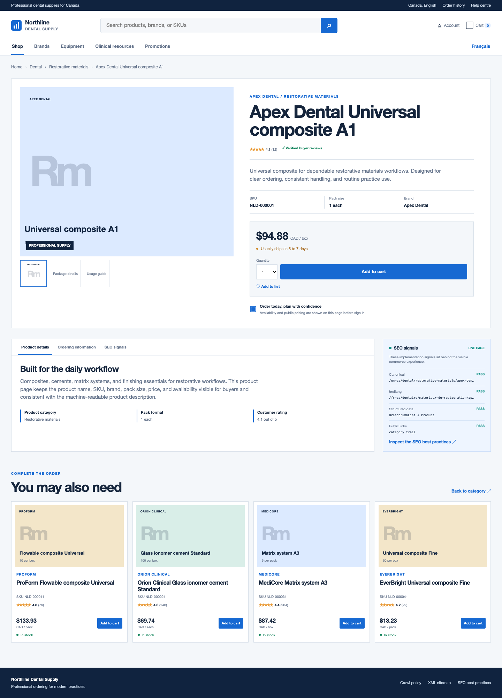

# B2B Commerce SEO Best Practices

Northline Dental Supply is a working B2B commerce example that demonstrates SEO best practices for category pages, product pages, crawl access, discovery, structured data, and market variants. The storefront contains 360 catalog products across 10 clinical categories and two Canadian market variants.

## What it teaches

- `robots.txt` controls crawler access.
- `sitemap.xml` lists public canonical URLs for discovery.
- Normal HTML links connect category pages to product pages.
- `BreadcrumbList` describes page hierarchy.
- `ItemList` describes the products presented on a category page.
- `Product` JSON-LD describes one product.
- Canonical URLs identify each page version.
- Reciprocal `hreflang` links connect equivalent English and French pages.
- Public offer fields must match what an anonymous visitor can see.

## Run locally

```bash
npm run build
npm start
```

Open [http://localhost:4173](http://localhost:4173).

## Pages to inspect

- `/` explains the model and links to the working pages.
- `/en-ca/` is the English storefront entry point.
- `/fr-ca/` is the French storefront entry point.
- `/en-ca/dental/restorative-materials/` is the English category page.
- `/fr-ca/dentaire/materiaux-de-restauration/` is the French category page.
- Each product page contains Product JSON-LD, BreadcrumbList, canonical, and `hreflang` output.
- `/robots.txt` points to `/sitemap.xml`.
- `/sitemap.xml` lists the public category and product URLs.

## Inspect the source

Open a category or product page and compare:

1. The visible heading, links, and product facts.
2. The canonical URL in the document head.
3. The reciprocal English and French `hreflang` links.
4. The JSON-LD scripts in the page source.
5. The matching URL in the sitemap.

## Screenshots







## Deploy

The project produces a static `dist` directory and includes a `vercel.json` configuration for deployment on Vercel.
